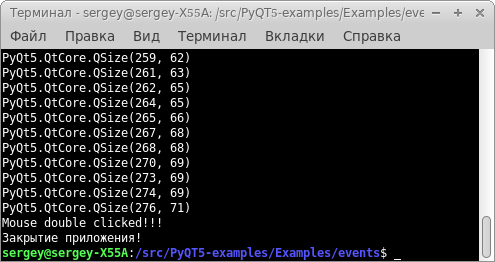

# Events - события.
### [Код](../Examples/events/events.py)

Когда наше приложение запускается, сворачивается, разворачивается, меняет свой размер или положение на экране возникает событие. Как и в других графических фреймворках, в QT имеется огромное количество самых разных событий. Разные виджеты имеют разный набор событий. Посмотреть события QWidget можно в офф. документации: [Events](https://doc.qt.io/qtforpython/PySide6/QtWidgets/QWidget.html#events).

Для работы с событиями нашего окна, нужно в классе MyWindow переопределить метод, с именем события.
Список основных событий (не полный!):
+ resizeEvent() - вызывается при изменении размера виджета;
+ mouseDoubleClickEvent() - вызывается при двойном клике мышью по виджету;
+ closeEvent() - вызывается при закрытии виджета.

Напишем следующий код:
```python
class MyWindow(QtWidgets.QWidget):
    def __init__(self):
        QtWidgets.QWidget.__init__(self)

        self.resize(300, 100)
        self.setWindowTitle("Hello")

    def closeEvent(self, event):
        print('Закрытие приложения!') # Вместо print сюда можно поместить, например, метод сохранения настроек, закрытие соединения с базой данных, и т.д.
        
    def resizeEvent(self, event):
        print(self.size()) # Выводим в консоль текущий размер окна

    def mouseDoubleClickEvent(self, event):
        print('Mouse double clicked!!!') # Догадайтесь :)
```
Запустите данный код и попробуйте изменить размер окна, кликнете мышью по нему и закройте приложение. Обратите внимание на консоль:


Реагирование на события других виджетов рассмотрим в следующих примерах.