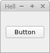
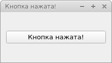

# QPushButton (кнопка)
### [Код](../Examples/push_button/push_button.py)

QPushButton - это кнопка. Для того, что-бы создать и показать кнопку, нужно сначала создать layout (макет - рассмотрим позже), добавить в него виджет (в нашем случае кнопку) и присвоить этот макет окну:
```python
        self.box_layout = QtWidgets.QHBoxLayout() # Создаем BoxLayout layout

        self.button = QtWidgets.QPushButton("Button") # Создаем саму кнопку и задаем ей текст

        self.box_layout.addWidget(self.button) # Добавляем на layout кнопку
        self.setLayout(self.box_layout) # Присваиваем окну layout
```


При создании кнопки в конструктор класса QPushButton можно передать следующие параметры:
+ text - задаем текст кнопки;
+ icon - задаем иконку кнопки;
Также можно вообще не передавать никакие параметры, а установить их позже. Например:
```python
self.button = QtWidgets.QPushButton()
self.button.setText('Button')
```
Отлично! Кнопка создана, мы её видим в нашем приложении, можем даже покликать. Но она ничего не будет делать. Для того, что-бы кнопка реагировала на клик, нужно создать в нашем классе (необязательно) метод(имя может быть практически любым) и соединить c событием (clicked) нашей кнопки. Следующий пример по клику на кнопку печатает в терминал текст "Button clicked!":
```python
    def __init__(self):
        QtWidgets.QWidget.__init__(self)

        self.resize(300, 100)
        self.setWindowTitle("Hello")
        
        self.box_layout = QtWidgets.QHBoxLayout() # Создаем BoxLayout layout

        self.button = QtWidgets.QPushButton()
        self.button.setText('Button')
        self.button.clicked.connect(self.click) 

        self.box_layout.addWidget(self.button) # Добавляем на layout кнопку
        self.setLayout(self.box_layout) # Устанавливаем окну layout

    def click(self): # Метод обработки нажатия на кнопку
        print('Button clicked!')
```
Обратите внимание, метод нужно передавать без круглых скобок!

Напишем ещё один пример: по клику на кнопку будем менять текст самой кнопки и окна:
```python
    def __init__(self):
        QtWidgets.QWidget.__init__(self)

        self.resize(300, 100)
        self.setWindowTitle("Hello")
        
        self.box_layout = QtWidgets.QHBoxLayout() # Создаем BoxLayout layout

        self.button = QtWidgets.QPushButton()
        self.button.setText('Button')
        self.button.clicked.connect(self.click) 

        self.box_layout.addWidget(self.button) # Добавляем на layout кнопку
        self.setLayout(self.box_layout) # Устанавливаем окну layout

    def click(self): # Метод обработки нажатия на кнопку
        self.button.setText('Кнопка нажата!')
        self.setWindowTitle('Кнопка нажата!')
```


Дополнительная информация: [QPushButton](https://doc.qt.io/qtforpython/PySide6/QtWidgets/QPushButton.html).